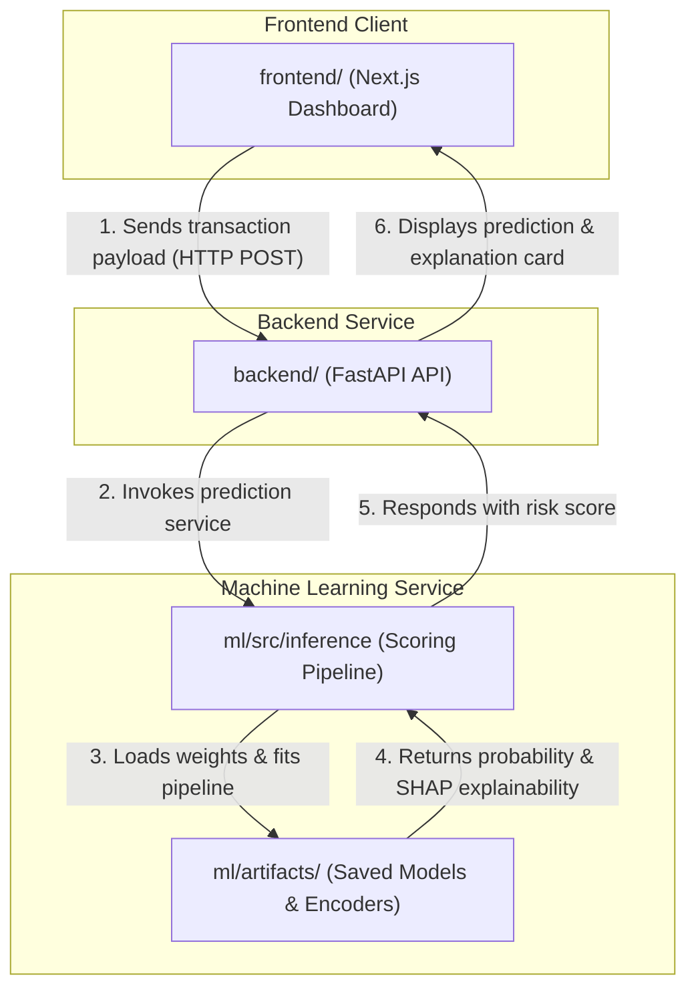

# FraudLens AI - Monorepo

An enterprise-grade, production-quality AI-powered framework for real-time transaction fraud detection and explainable risk scoring.

## Repository Architecture

This project is structured as a monorepo following enterprise standards to maintain a clear separation of concerns:

```
FraudLens-AI/
├── .github/workflows/   # CI/CD pipelines
├── backend/             # FastAPI REST API backend service
├── docs/                # Architectural design and project journals
├── frontend/            # Next.js React user interface client dashboard
├── ml/                  # Machine learning development stack
├── docker-compose.yml   # Multi-service local orchestrations
├── LICENSE              # Open source license (MIT)
├── README.md            # Root repository guide
└── .env.example         # Root level template environment configuration
```

### Components Description

- **`frontend/`**: Next.js App Router providing interactive transactional visualizations, alert monitoring, and explainability cards (generated using Stitch MCP).
- **`backend/`**: FastAPI REST service handling transaction scoring requests, querying logs, and coordinating predictions.
- **`ml/`**: Machine learning development stack containing data preprocessing, feature engineering, training loops, explainability, evaluations, and artifacts.
- **`docs/`**: Holds project journals, roadmap plans, and specifications.

---

## Interaction Flow Diagram

Below is the Mermaid architecture diagram illustrating the interaction flow from the client application down to the model artifacts:



---

## Development Workflow

Each subproject (`ml/`, `backend/`, `frontend/`) operates as a self-contained service with its own local requirements, configurations, and environment setups.

### Machine Learning Stack (Local Setup)
```bash
cd ml
python3 -m venv .venv
source .venv/bin/activate
pip install -r requirements.txt
```

### Backend API Setup
```bash
cd backend
python3 -m venv .venv
source .venv/bin/activate
pip install -r requirements.txt
uvicorn app.main:app --reload
```

### Frontend Dashboard Setup
```bash
cd frontend
npm install
npm run dev
```

---

## Future Deployment Architecture

In production, the services are orchestrated using container pipelines:
- **API Gateways**: Route incoming client requests to FastAPI backend containers.
- **FastAPI Containers**: Scaled horizontally using Kubernetes (GKE / EKS) behind load balancers.
- **Model Server (Inference)**: Decoupled model serving using Triton Inference Server or Ray Serve to optimize latency and hardware utilization.
- **Offline Pipelines**: Dataproc Spark or Airflow DAGs triggering offline batch training.
- **Model Registry**: MLflow model registry managing versioning and staging transits.
- **Alert Queue**: Real-time message streaming queues (Kafka / Google Pub/Sub) logging high-risk prediction scores for secondary inspections.

---

## License
Distributed under the MIT License. See [LICENSE](LICENSE) for more information.
